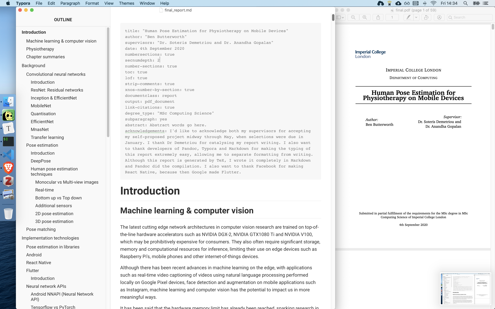

Let's face it, it's easier to write in Markdown than in LaTex. With Pandoc, you can write in Markdown and generate LaTex PDFs for submission. An example report is provided in `final_report.md`, and the output PDF is `final.pdf`. Start editing the `final_report.md`, and modify it for your own report.

In the screenshot, you can see I write in Typora on the left, and it automagically generates the PDF on the right when I run the `./create_report.sh`

Instructions on how to use Pandoc properly is available at [this blog post](https://orth.uk/markdown-for-convenient-academic-writing/). It's a little complicated, but its worth it if you find LaTex too complex. 

This theme is based off the original theme provided by Imperial College, and was modified to for use with Pandoc. 
